# 📱 Guía de Uso - Sistema de Talleres CBTis 258 (Versión Beta)

> **¡Bienvenido a la versión beta!** Esta guía te ayudará a usar el sistema y proporcionar feedback valioso.

---

## 🎯 ¿Qué es este sistema?

Sistema web para gestionar talleres extracurriculares del CBTis 258. Permite a estudiantes inscribirse en talleres (culturales, deportivos y cívicos) y a instructores gestionar sus grupos.

---

## 🏗️ Arquitectura del Sistema

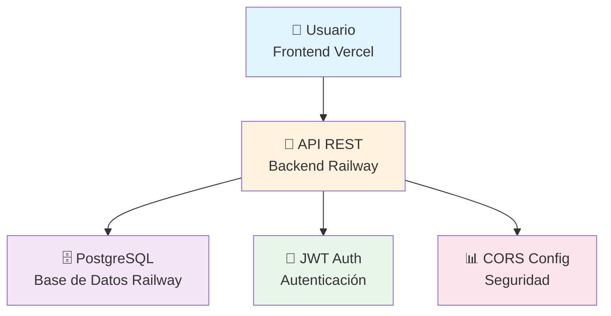

---

## 👥 Tipos de Usuario

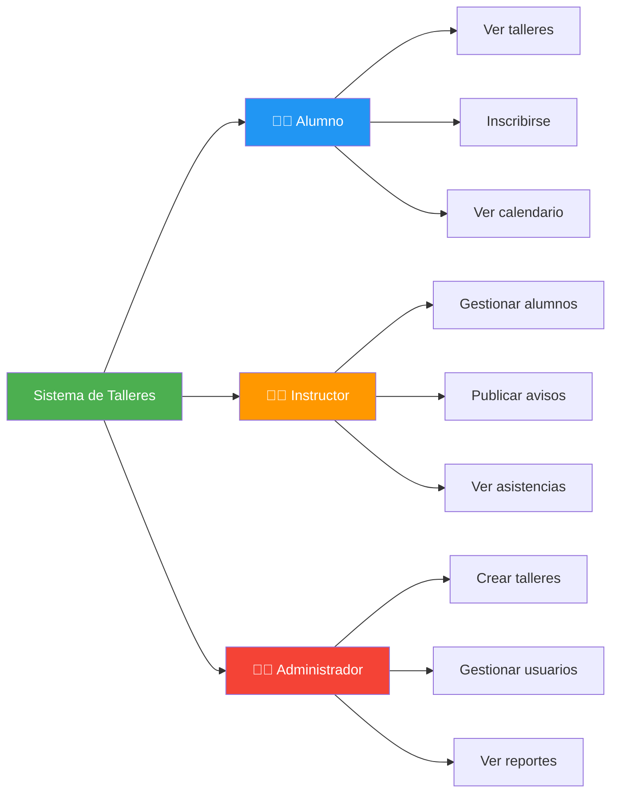

---

## 🚀 Flujo de Registro e Inicio de Sesión

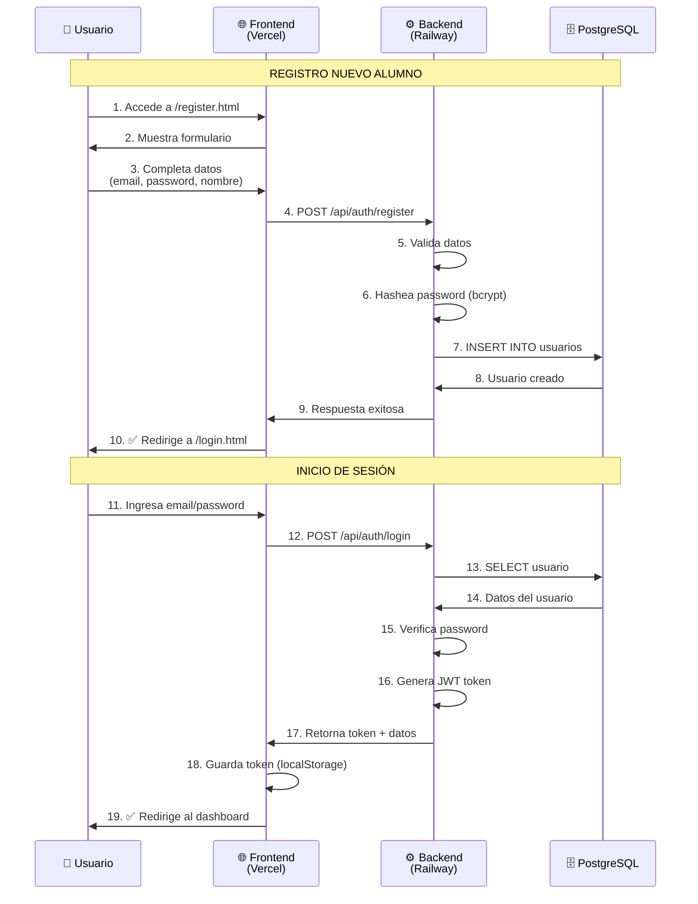

---

## 📚 Flujo del Alumno - Inscripción a Taller

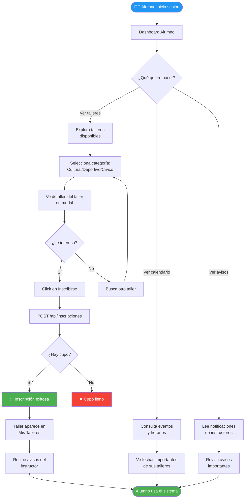

---

## 👨‍🏫 Flujo del Instructor - Gestión de Taller

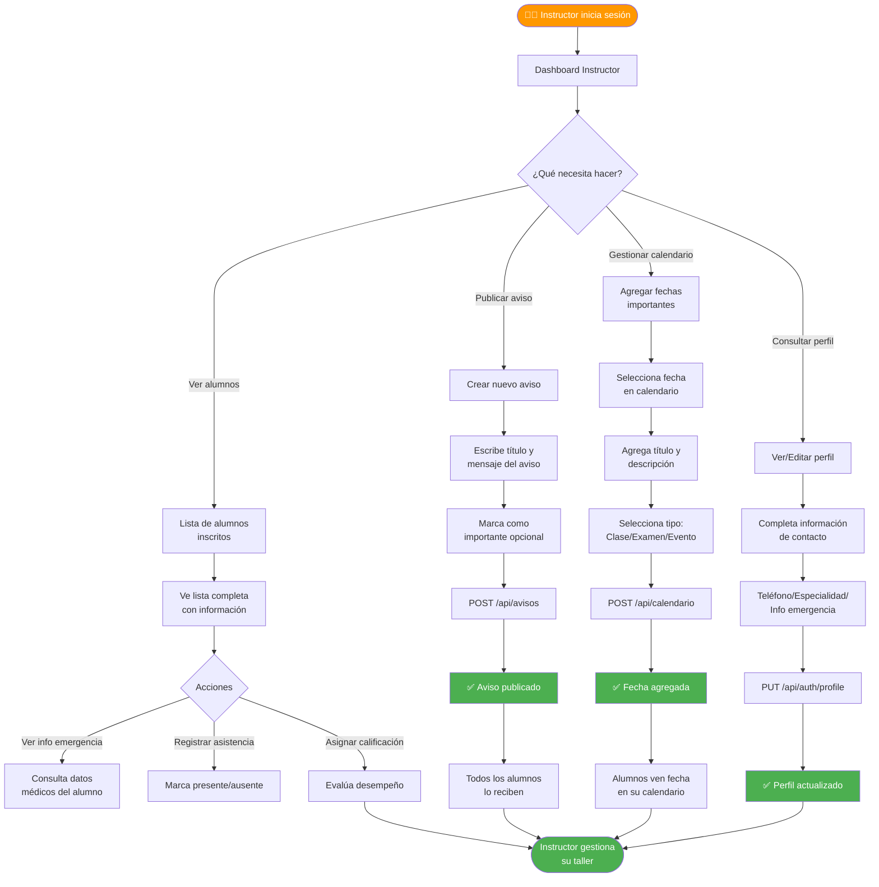

---

## 👨‍💼 Flujo del Administrador - Gestión Completa

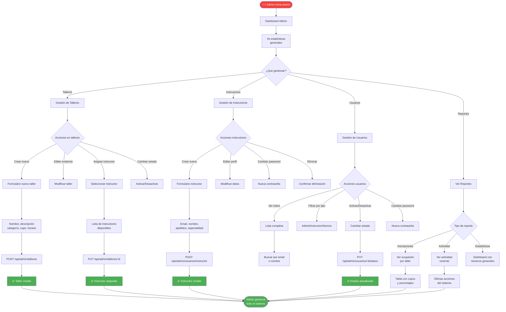

---

## 🔄 Flujo de Datos - Inscripción a Taller

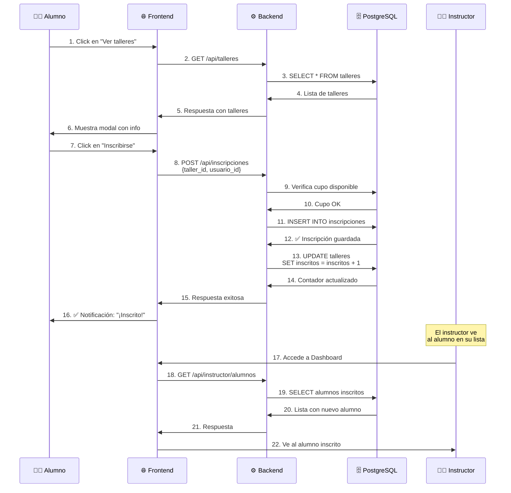

---

## 🎨 Flujo Visual - Navegación del Sistema

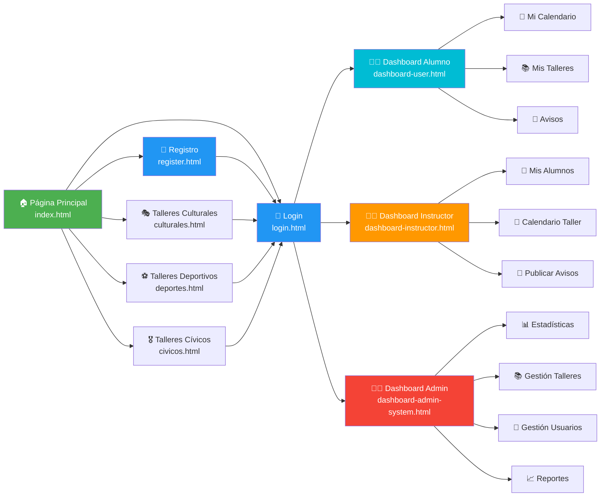

---

## 🔐 Flujo de Autenticación JWT

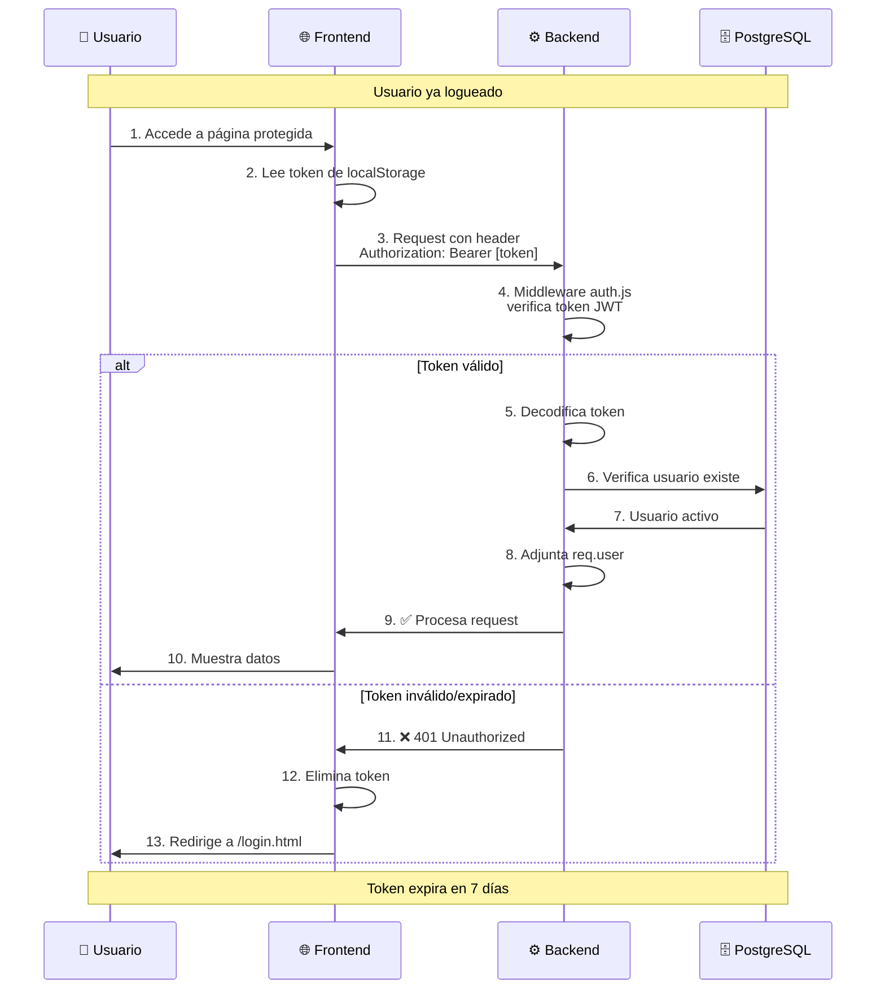

---

## 📊 Modelo de Datos Simplificado

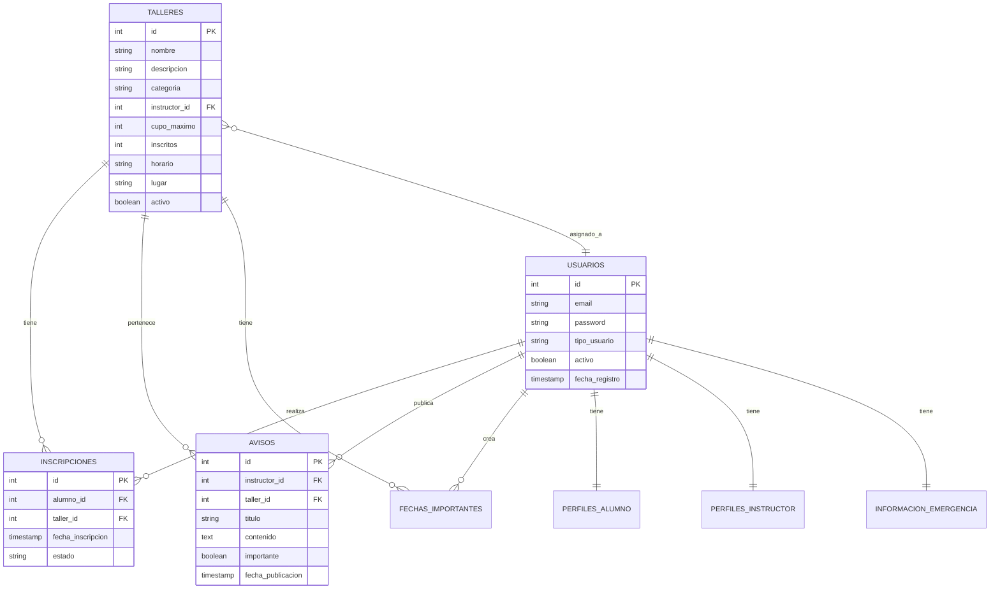

---

## 🧪 Cómo Usar la Versión Beta

### Paso 1: Accede al Sistema
```
🌐 URL: https://proyecto-talleres-cbtis258.vercel.app
```

### Paso 2: Regístrate como Alumno
1. Click en "Registrarse"
2. Completa el formulario con tus datos
3. Click en "Crear Cuenta"
4. Inicia sesión con tu email y contraseña

### Paso 3: Explora Talleres
1. En el dashboard, ve a "Mis Talleres"
2. Explora talleres por categoría
3. Click en "Ver más" para detalles
4. Click en "Inscribirse"

### Paso 4: Usa el Calendario
1. Ve a la sección "Calendario"
2. Consulta fechas importantes
3. Verás eventos de tus talleres inscritos

### Paso 5: Lee Avisos
1. Sección "Avisos"
2. Revisa notificaciones de instructores
3. Los importantes aparecen destacados

---

## 📝 ¿Cómo Dar Feedback?

### Lo que necesitamos saber:

1. **🐛 Bugs encontrados:**
   - ¿Qué estabas haciendo?
   - ¿Qué esperabas que pasara?
   - ¿Qué pasó en realidad?
   - Captura de pantalla si es posible

2. **💡 Sugerencias de mejora:**
   - ¿Qué te gustaría que tuviera?
   - ¿Qué no te gustó?
   - ¿Qué cambiarías?

3. **✅ Lo que funciona bien:**
   - ¿Qué te gustó?
   - ¿Qué fue fácil de usar?

### Reporta feedback por:
- 📧 Email: [sergio.sanchez@cbtis258.edu.mx]
- 🐙 GitHub Issues: https://github.com/sergiodev3/proyecto-talleres-cbtis258/issues

---

## ❓ Preguntas Frecuentes

**P: ¿Necesito crear cuenta para ver talleres?**  
R: No, puedes explorar talleres sin cuenta. Solo necesitas cuenta para inscribirte.

**P: ¿Puedo inscribirme a varios talleres?**  
R: Sí, puedes inscribirte a múltiples talleres mientras haya cupo.

**P: ¿Cómo cancelo mi inscripción?**  
R: Contacta al instructor o administrador (función en desarrollo).

**P: ¿Los instructores pueden verme?**  
R: Sí, una vez inscrito apareces en su lista de alumnos.

**P: ¿Es seguro?**  
R: Sí, usamos encriptación (HTTPS) y autenticación JWT. Tu contraseña está hasheada.

---

## 🚀 Tecnologías Usadas

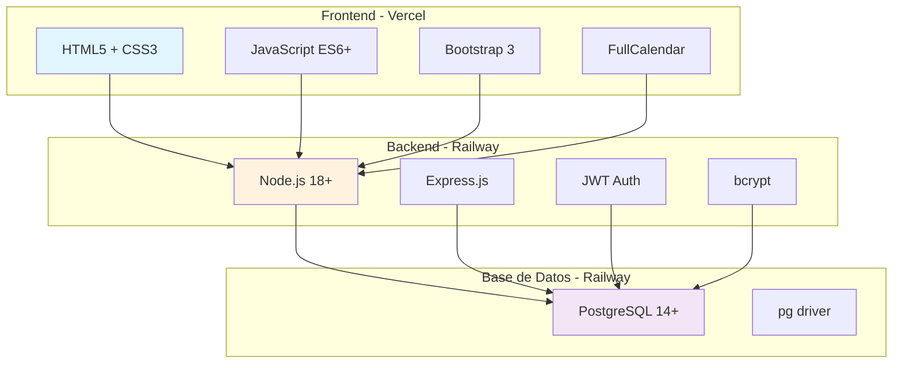

---

## 🎯 Roadmap Futuro

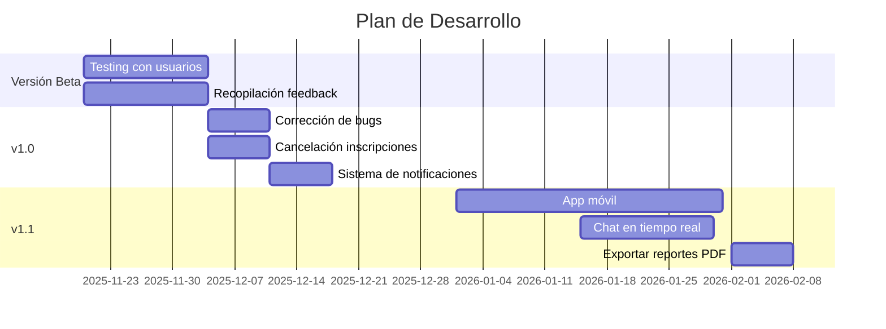

---

## 🙏 Agradecimientos

¡Gracias por probar la versión beta! Tu feedback es invaluable para mejorar el sistema.

**Desarrollado con ❤️ para CBTis 258**

---

📅 Versión Beta - Noviembre 2025  
🔗 Repositorio: https://github.com/sergiodev3/proyecto-talleres-cbtis258
